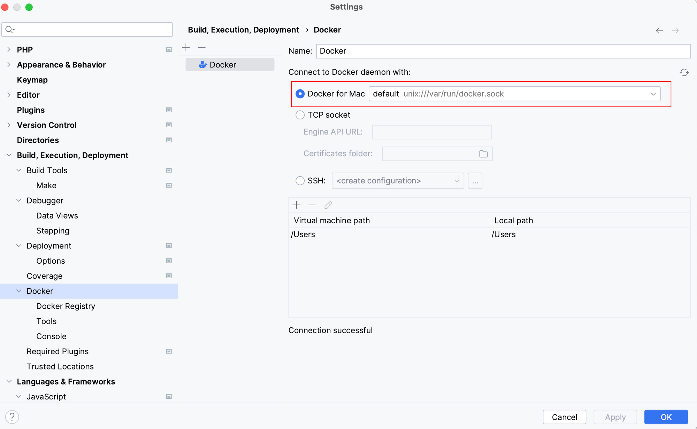
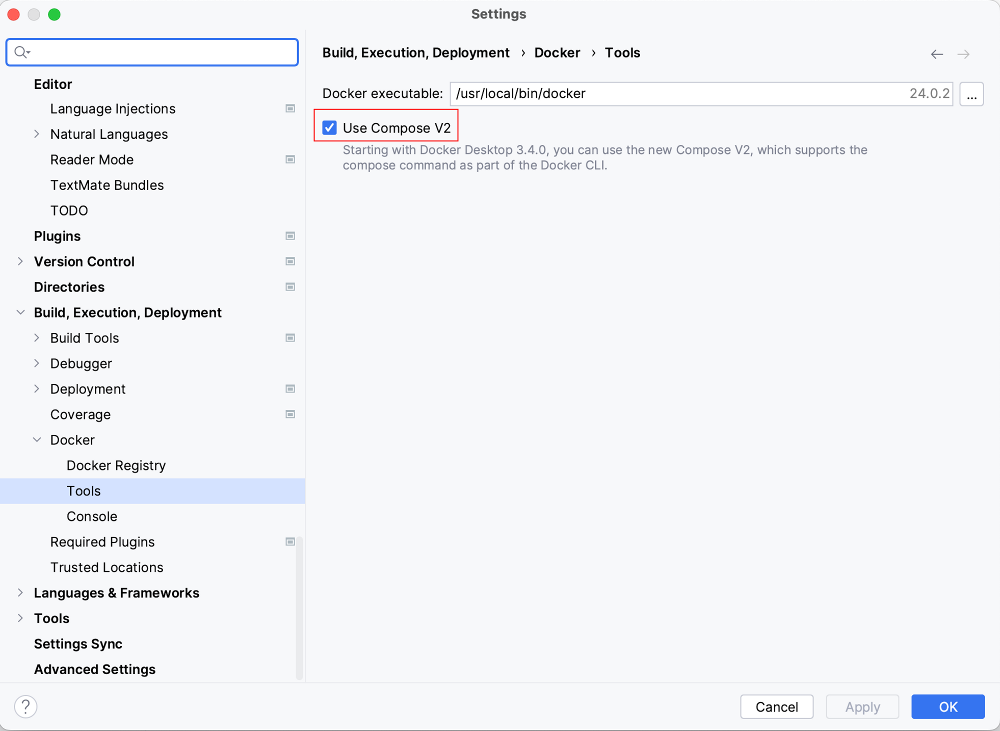
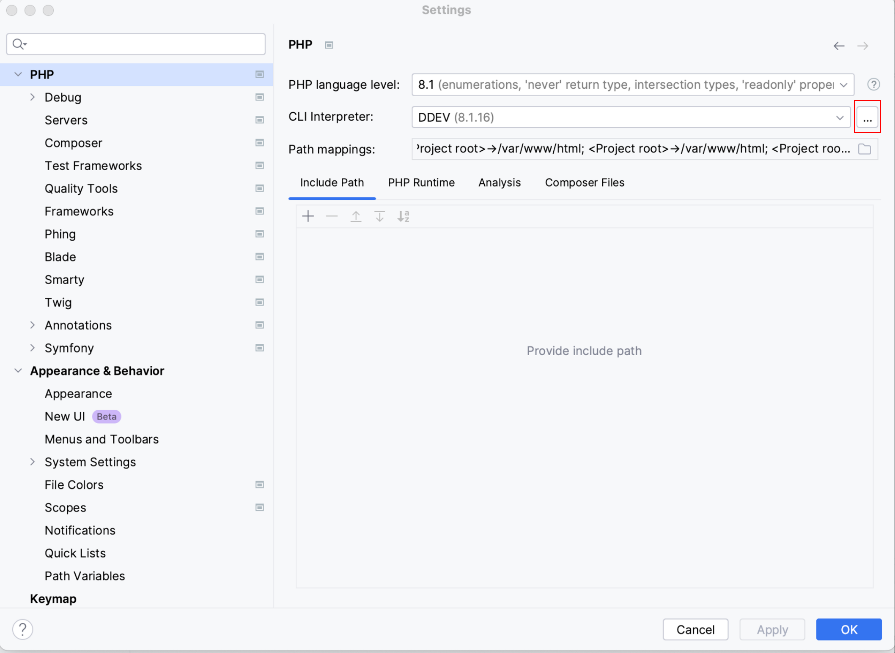
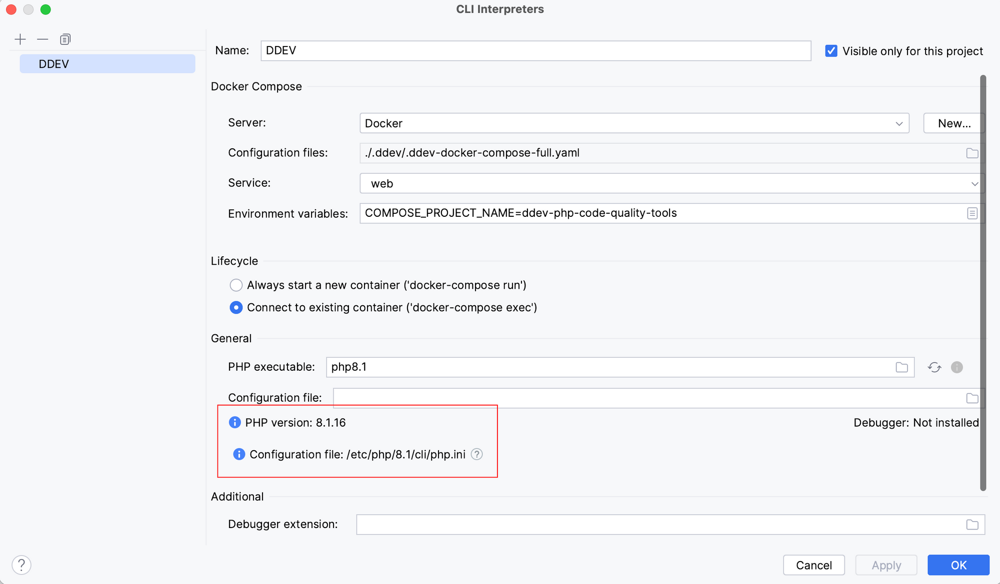
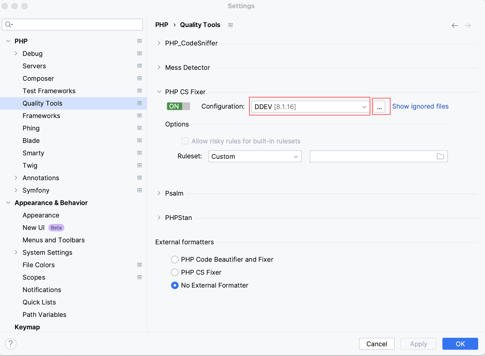
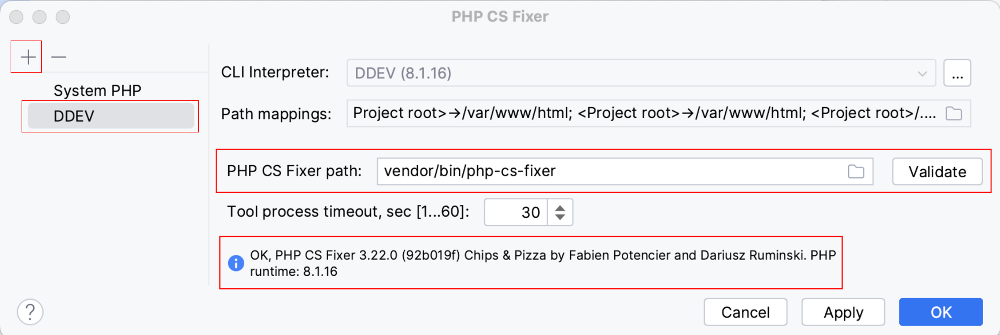

# PHPStorm Integration Guide

These tools run within DDEV (a Docker container). If you're using DDEV, make sure that its corresponding PHPStorm plugin is installed.

### Docker

Under **Build, Execution, Deployment > Docker**

The first step is to make sure that PHPStorm can connect to Docker containers properly.

It’s easiest to link Docker & PHPStorm if you’re using the official “Docker For Mac”. I’m sure it’s possible to use Colima or an alternate Docker runner, but it’s trickier to set up.

Make sure you’ve checked “Use Compose V2” under **Docker > Tools**

|  |  |
|---------------------------------|-----------------------------------|

### PHP CLI Interpreter

Under **PHP**

Make sure that your PHP CLI Interpreter is set to DDEV and all of your path mappings are correct (DDEV usually figures this out for you). 

|  |  | 
|-------------------------------------|---------------------------------------------|

### Validate your Code Quality Tools

Under **PHP > Quality Tools**

Now that your DDEV / Docker Containers are connected properly, you can verify that your tools paths are puling from your DDEV container. 

You'll want to make sure you're using **DDEV** instead of **System PHP**. Click the **+** icon if DDEV isn't present. 

